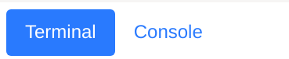
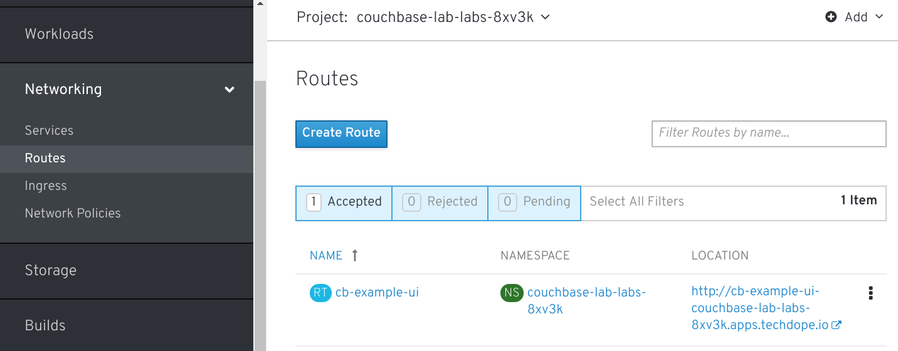

Now that the couchbase cluster has been deployed, let's take a look at the console for administration of the cluster. In order to access the console, we first need to find and expose the kubernetes service for the UI.  

```execute-1
oc get svc
```

You should see the following output:

    NAME             TYPE        CLUSTER-IP      EXTERNAL-IP   PORT(S)
            AGE
    cb-example       ClusterIP   None            <none>        8091/TCP,18091/TCP
            3m
    cb-example-srv   ClusterIP   None            <none>        11210/TCP,11207/TCP
            3m
    cb-example-ui    NodePort    172.30.44.247   <none>        8091:32711/TCP,18091:314
    45/TCP   3m

The service that exposes the web console is called *cb-example-ui*.  To expose this service, we simply need to use the *oc expose* command passing in the name of the service.

```execute-1
oc expose svc/cb-example-ui
```

We can then view the URL get issuing the oc get routes command:

```execute-1
oc get routes
```

You should see output like the following:

    NAME            HOST/PORT                                                 PATH
    SERVICES        PORT        TERMINATION   WILDCARD
    cb-example-ui   cb-example-ui-couchbase-lab-labs-8xv3k.apps.techdope.io
    cb-example-ui   couchbase                 None

In the above example, the URL is *cb-example-ui-couchbase-lab-labs-8xv3k.apps.techdope.io.*

This can also be viewed in the OpenShift web console. Click on the console tab to switch to the browser view.



Next, expand the *Network* tab and then click on *Routes*. This will show the created route.


