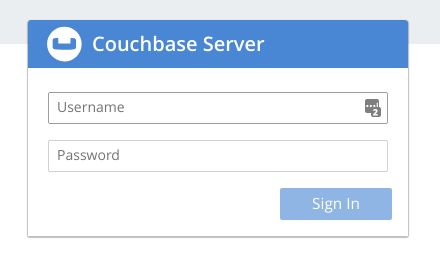

At this point, you should have the authentication page open for the Couchbase web console.  If you do not, please go back to the previous step and open the route associated with your cluster.



Login using the credentials that we created in step 2, using the *cb-example-auth* which are:

Username: Administrator
Password: password

Once you have authenticated, you should be presented with the cluster console for the database.


Now let's edit the number of replicas from three to four.  Edit the couchbase-cluster.yaml file and change the number of servers to 4.

```execute-1
oc edit CouchbaseCluster/cb-example
```

Look for the following stanza using your arrows keys:

    servers:
    - name: all_services
        services:
        - data
        - index
        - query
        - search
        - eventing
        - analytics
        size: 3

Change the size to say 4 and then type :wq to save your changes.

We now need to watch and wait for the new container to be in a running state.

```execute-2
oc get pods -l couchbase_cluster=cb-example --watch
```

Once the new container is in a running state, head over to the couchbase web console and click on the servers tab.  You should see a notice that the cluster is rebalancing itself to accomodate the 4th container in the cluster.


Pretty awesome, huh?