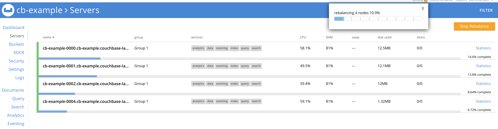

At this point, you should have the authentication page open for the Couchbase web console. If you do not, please go back to the previous step and open the route associated with your cluster.


Login using the credentials that we created in step 2, using the *cb-example-auth* which are:

* Username: Administrator
* Password: password

Once you have authenticated, you should be presented with the cluster console for the database.


Now let's edit the number of replicas from three to four.  We are going to use a bit of command line magic to do this but we are essentially modifying the following stanza of the `CouchbaseCluster/cb-example` object.

```
    servers:
    - name: all_services
        services:
        - data
        - index
        - query
        - search
        - eventing
        - analytics
        size: 3
```

We will be changing `size: 3` to be `size: 4`

```execute-1
oc get CouchbaseCluster/cb-example -o yaml | sed -e 's/size: 3/size: 4/' | oc apply -f -
```

We now need to watch and wait for the new container to be in a running state.

```execute-2
watch oc get pods -l couchbase_cluster=cb-example
```

Once the new container is in a running state, head over to the Couchbase web console and click on the servers tab. You should see a notice that the cluster is rebalancing itself to accomodate the 4th container in the cluster.



Pretty awesome, huh?
